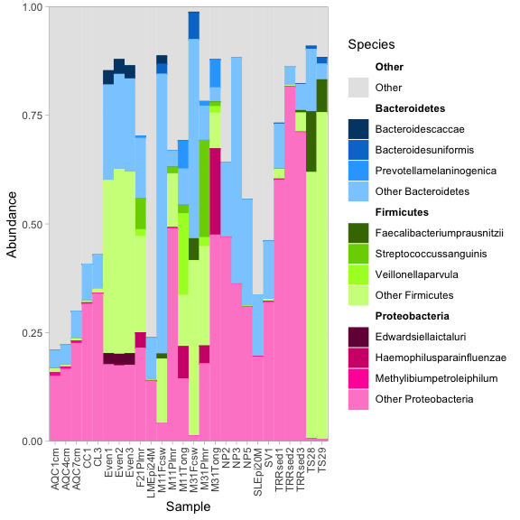
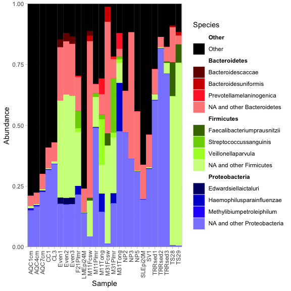
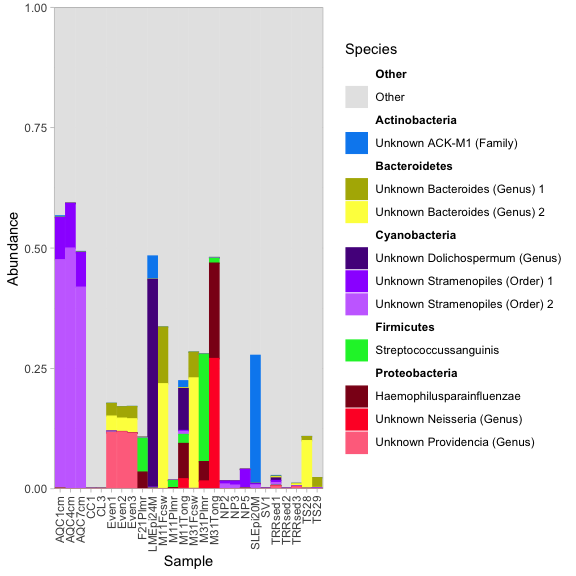
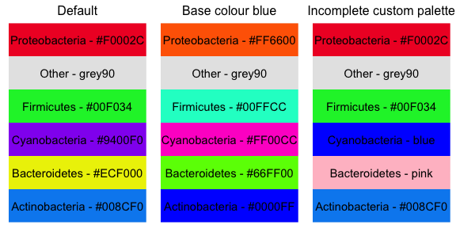
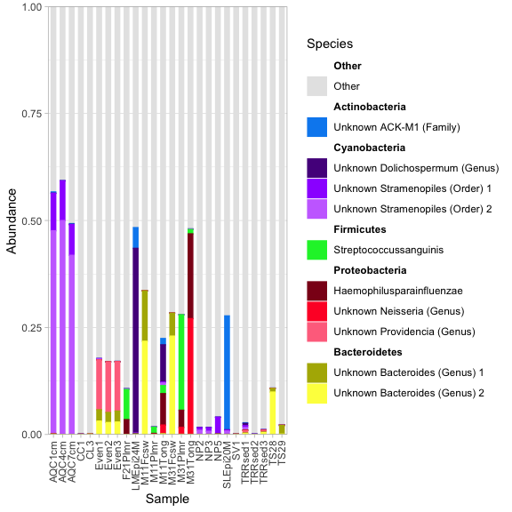
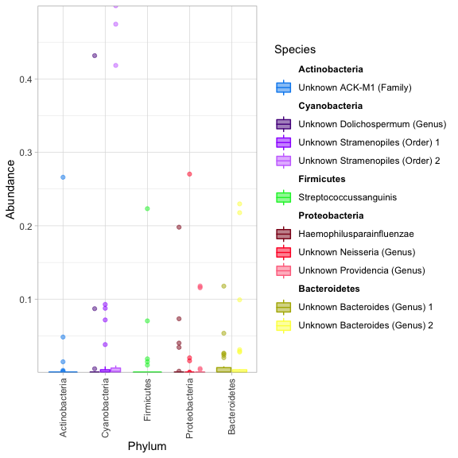
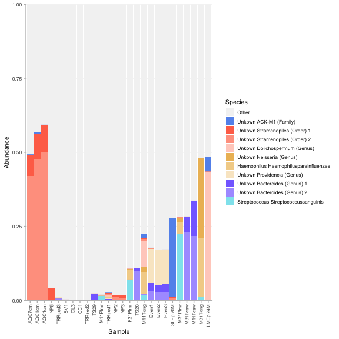

<!-- README.md is generated from README.Rmd. Please edit that file -->

# fantaxtic

`fantaxtic` contains a set of functions to identify and visualize the
most abundant taxa in phyloseq objects. It allows users to identify top
taxa using any metric and any grouping, and plot the (relative)
abundances of the top taxa using a nested bar plot visualisation. In the
nested bar plot, colours or fills signify a top taxonomic rank
(e.g. Phylum), and a gradient of shades and tints signifies levels at a
nested taxonomic rank (e.g. Species). It is particularly useful to
present an overview of microbiome sequencing, amplicon sequencing or
metabarcoding data.

Note that `fantaxtic` is essentially a wrapper around
[`ggnested`](https://github.com/gmteunisse/ggnested), with some
accessory functions to identify top taxa and to ensure that the plot is
useful. Thus, the output is `ggplot2` object, and can be manipulated as
such.

**Keywords: nested bar plot, phyloseq, taxonomy, most abundant taxa,
multiple levels, shades, tints, gradient, 16S, ITS ,18S, microbiome,
amplicon sequencing, metabarcoding**

## Installation

``` r
if(!"devtools" %in% installed.packages()){
  install.packages("devtools")
}
devtools::install_github("gmteunisse/fantaxtic")
```

## Basic usage

The workflow consists of two parts:

1.  Identify top taxa using either `top_taxa` or `nested_top_taxa`
2.  Visualise the top taxa using `nested_bar_plot`

For basic usage, only a few lines of R code are required. To identify
and plot the top 10 most abundant ASVs by their mean relative abundance,
using Phylum as the top rank and Species as the nested rank, run:

``` r
require("fantaxtic")
require("phyloseq")
require("tidyverse")
require("magrittr")
require("ggnested")
require("knitr")
require("gridExtra")
```

``` r
data(GlobalPatterns)
top_asv <- top_taxa(GlobalPatterns, n_taxa = 10)
plot_nested_bar(ps_obj = top_asv$ps_obj,
                top_level = "Phylum",
                nested_level = "Species")
```

<!-- -->

To identify and plot the top 3 most abundant Phyla, and the top 3 most
abundant species within those Phyla, run:

``` r
top_nested <- nested_top_taxa(GlobalPatterns,
                              top_tax_level = "Phylum",
                              nested_tax_level = "Species",
                              n_top_taxa = 3, 
                              n_nested_taxa = 3)
plot_nested_bar(ps_obj = top_nested$ps_obj,
                top_level = "Phylum",
                nested_level = "Species")
```

<!-- -->

### `top_taxa`

This function identifies the top *n* taxa by some metric (e.g. mean,
median, variance, etc.) in a phyloseq object. It outputs a table with
the top taxa, as well as a phyloseq object in which all other taxa have
been merged into a single taxon.

#### Taxonomic rank

By default, `top_taxa` runs the analysis at the ASV level; however, if a
`tax_level` is specified (e.g. `Species`), it first agglomerates the
taxa in the phyloseq object at that rank and then runs the analysis.
Note that taxonomic agglomeration makes the assumption that taxa with
the same name at all ranks are identical. This also includes taxa with
missing annotations (`NA`). By default, `top_taxa` does not considered
taxa with an `NA` annotation at `tax_level`, but this can be overcome by
setting `include_na_taxa = T`.

``` r
top_species <- top_taxa(GlobalPatterns,
                        n_taxa = 10, 
                        tax_level = "Species")
top_species$top_taxa %>%
  mutate(abundance = round(abundance, 3)) %>%
  kable(format = "markdown")
```

| tax_rank | taxid  | abundance | Kingdom  | Phylum         | Class               | Order             | Family             | Genus            | Species                     |
|---------:|:-------|----------:|:---------|:---------------|:--------------------|:------------------|:-------------------|:-----------------|:----------------------------|
|        4 | 326977 |     0.010 | Bacteria | Actinobacteria | Actinobacteria      | Bifidobacteriales | Bifidobacteriaceae | Bifidobacterium  | Bifidobacteriumadolescentis |
|        9 | 9514   |     0.005 | Bacteria | Proteobacteria | Gammaproteobacteria | Pasteurellales    | Pasteurellaceae    | Actinobacillus   | Actinobacillusporcinus      |
|        1 | 94166  |     0.014 | Bacteria | Proteobacteria | Gammaproteobacteria | Pasteurellales    | Pasteurellaceae    | Haemophilus      | Haemophilusparainfluenzae   |
|        8 | 469778 |     0.005 | Bacteria | Bacteroidetes  | Bacteroidia         | Bacteroidales     | Bacteroidaceae     | Bacteroides      | Bacteroidescoprophilus      |
|        6 | 471122 |     0.006 | Bacteria | Bacteroidetes  | Bacteroidia         | Bacteroidales     | Prevotellaceae     | Prevotella       | Prevotellamelaninogenica    |
|       10 | 248140 |     0.005 | Bacteria | Bacteroidetes  | Bacteroidia         | Bacteroidales     | Bacteroidaceae     | Bacteroides      | Bacteroidescaccae           |
|        7 | 470973 |     0.005 | Bacteria | Firmicutes     | Clostridia          | Clostridiales     | Lachnospiraceae    | Ruminococcus     | Ruminococcustorques         |
|        3 | 171551 |     0.011 | Bacteria | Firmicutes     | Clostridia          | Clostridiales     | Ruminococcaceae    | Faecalibacterium | Faecalibacteriumprausnitzii |
|        2 | 98605  |     0.013 | Bacteria | Firmicutes     | Bacilli             | Lactobacillales   | Streptococcaceae   | Streptococcus    | Streptococcussanguinis      |
|        5 | 114821 |     0.009 | Bacteria | Firmicutes     | Clostridia          | Clostridiales     | Veillonellaceae    | Veillonella      | Veillonellaparvula          |

#### Grouping

Furthermore, if one or more grouping factors are specified in
`grouping`, it will calculate the top *n* taxa using the samples in each
group, rather than using all samples in the phyloseq object. This makes
it possible to for example identify the top taxa in each sample, or the
top taxa in each treatment group.

``` r
top_grouped <- top_taxa(GlobalPatterns,
                        n_taxa = 1,
                        grouping = "SampleType")
top_grouped$top_taxa %>%
  mutate(abundance = round(abundance, 3)) %>%
  kable(format = "markdown")
```

| SampleType         | tax_rank | taxid  | abundance | Kingdom  | Phylum         | Class                 | Order             | Family             | Genus                | Species                |
|:-------------------|---------:|:-------|----------:|:---------|:---------------|:----------------------|:------------------|:-------------------|:---------------------|:-----------------------|
| Freshwater (creek) |        1 | 549656 |     0.464 | Bacteria | Cyanobacteria  | Chloroplast           | Stramenopiles     | NA                 | NA                   | NA                     |
| Freshwater         |        1 | 279599 |     0.216 | Bacteria | Cyanobacteria  | Nostocophycideae      | Nostocales        | Nostocaceae        | Dolichospermum       | NA                     |
| Ocean              |        1 | 557211 |     0.071 | Bacteria | Cyanobacteria  | Synechococcophycideae | Synechococcales   | Synechococcaceae   | Prochlorococcus      | NA                     |
| Tongue             |        1 | 360229 |     0.145 | Bacteria | Proteobacteria | Betaproteobacteria    | Neisseriales      | Neisseriaceae      | Neisseria            | NA                     |
| Mock               |        1 | 550960 |     0.117 | Bacteria | Proteobacteria | Gammaproteobacteria   | Enterobacteriales | Enterobacteriaceae | Providencia          | NA                     |
| Sediment (estuary) |        1 | 319044 |     0.080 | Bacteria | Proteobacteria | Deltaproteobacteria   | Desulfobacterales | Desulfobulbaceae   | NA                   | NA                     |
| Feces              |        1 | 331820 |     0.137 | Bacteria | Bacteroidetes  | Bacteroidia           | Bacteroidales     | Bacteroidaceae     | Bacteroides          | NA                     |
| Soil               |        1 | 36155  |     0.013 | Bacteria | Acidobacteria  | Solibacteres          | Solibacterales    | Solibacteraceae    | CandidatusSolibacter | NA                     |
| Skin               |        1 | 98605  |     0.103 | Bacteria | Firmicutes     | Bacilli               | Lactobacillales   | Streptococcaceae   | Streptococcus        | Streptococcussanguinis |

#### Ranking metric

Lastly, any metric can be used to rank taxa by specifying a function
through `FUN`. The mean is used by default, but depending on your
analysis, you might want to use the median, variance, maximum or any
other function that takes as input a numeric vector and outputs a single
number.

``` r
top_max <- top_taxa(GlobalPatterns,
                        n_taxa = 10,
                        FUN = max)
top_max$top_taxa %>%
  mutate(abundance = round(abundance, 3)) %>%
  kable(format = "markdown")
```

| tax_rank | taxid  | abundance | Kingdom  | Phylum         | Class               | Order           | Family           | Genus          | Species                   |
|---------:|:-------|----------:|:---------|:---------------|:--------------------|:----------------|:-----------------|:---------------|:--------------------------|
|        4 | 329744 |     0.266 | Bacteria | Actinobacteria | Actinobacteria      | Actinomycetales | ACK-M1           | NA             | NA                        |
|        1 | 549656 |     0.500 | Bacteria | Cyanobacteria  | Chloroplast         | Stramenopiles   | NA               | NA             | NA                        |
|        2 | 279599 |     0.432 | Bacteria | Cyanobacteria  | Nostocophycideae    | Nostocales      | Nostocaceae      | Dolichospermum | NA                        |
|        3 | 360229 |     0.270 | Bacteria | Proteobacteria | Betaproteobacteria  | Neisseriales    | Neisseriaceae    | Neisseria      | NA                        |
|        8 | 94166  |     0.198 | Bacteria | Proteobacteria | Gammaproteobacteria | Pasteurellales  | Pasteurellaceae  | Haemophilus    | Haemophilusparainfluenzae |
|        9 | 484436 |     0.196 | Bacteria | Proteobacteria | Gammaproteobacteria | Pseudomonadales | Moraxellaceae    | NA             | NA                        |
|        5 | 331820 |     0.230 | Bacteria | Bacteroidetes  | Bacteroidia         | Bacteroidales   | Bacteroidaceae   | Bacteroides    | NA                        |
|        7 | 189047 |     0.207 | Bacteria | Firmicutes     | Clostridia          | Clostridiales   | Ruminococcaceae  | NA             | NA                        |
|        6 | 98605  |     0.223 | Bacteria | Firmicutes     | Bacilli             | Lactobacillales | Streptococcaceae | Streptococcus  | Streptococcussanguinis    |
|       10 | 114821 |     0.187 | Bacteria | Firmicutes     | Clostridia          | Clostridiales   | Veillonellaceae  | Veillonella    | Veillonellaparvula        |

### `nested_top_taxa`

This function identifies the top *n* taxa at a taxonomic rank
(e.g. Phylum) and the top *m* nested taxa at a lower taxonomic rank
(e.g. Species) by some metric (e.g. mean, median, variance, etc.) in a
phyloseq object. Internally, it makes use of `top_taxa`, and therefore
uses many of the same options. Like `top_taxa`, it agglomerates taxa at
the specified taxonomic ranks before identifying the top taxa. It
outputs a table with the top taxa, as well as a phyloseq object in which
all non-top taxa have been merged, both at the `top_tax_level` and at
the `nested_tax_level`. This function is especially nice for providing
overviews of your data, as it shows the relative abundance of each
select `top_tax_level` taxon.

``` r
top_nested <- nested_top_taxa(GlobalPatterns,
                              top_tax_level = "Phylum",
                              nested_tax_level = "Species",
                              n_top_taxa = 3, 
                              n_nested_taxa = 3, 
                              nested_merged_label = "NA and other <tax>")
top_nested$top_taxa %>%
  mutate(top_abundance = round(top_abundance, 3),
         nested_abundance = round(nested_abundance, 3)) %>%
  kable(format = "markdown")
```

| taxid  | top_abundance | nested_abundance | top_tax_rank | nested_tax_rank | Kingdom  | Phylum         | Class               | Order             | Family             | Genus            | Species                     |
|:-------|--------------:|-----------------:|-------------:|----------------:|:---------|:---------------|:--------------------|:------------------|:-------------------|:-----------------|:----------------------------|
| 200741 |         0.295 |            0.072 |            1 |               3 | Bacteria | Proteobacteria | Betaproteobacteria  | Burkholderiales   | NA                 | Methylibium      | Methylibiumpetroleiphilum   |
| 94166  |         0.295 |            0.122 |            1 |               1 | Bacteria | Proteobacteria | Gammaproteobacteria | Pasteurellales    | Pasteurellaceae    | Haemophilus      | Haemophilusparainfluenzae   |
| 236788 |         0.295 |            0.094 |            1 |               2 | Bacteria | Proteobacteria | Gammaproteobacteria | Enterobacteriales | Enterobacteriaceae | Edwardsiella     | Edwardsiellaictaluri        |
| 322235 |         0.173 |            0.110 |            3 |               2 | Bacteria | Bacteroidetes  | Bacteroidia         | Bacteroidales     | Bacteroidaceae     | Bacteroides      | Bacteroidesuniformis        |
| 471122 |         0.173 |            0.147 |            3 |               1 | Bacteria | Bacteroidetes  | Bacteroidia         | Bacteroidales     | Prevotellaceae     | Prevotella       | Prevotellamelaninogenica    |
| 248140 |         0.173 |            0.076 |            3 |               3 | Bacteria | Bacteroidetes  | Bacteroidia         | Bacteroidales     | Bacteroidaceae     | Bacteroides      | Bacteroidescaccae           |
| 171551 |         0.189 |            0.162 |            2 |               1 | Bacteria | Firmicutes     | Clostridia          | Clostridiales     | Ruminococcaceae    | Faecalibacterium | Faecalibacteriumprausnitzii |
| 98605  |         0.189 |            0.116 |            2 |               2 | Bacteria | Firmicutes     | Bacilli             | Lactobacillales   | Streptococcaceae   | Streptococcus    | Streptococcussanguinis      |
| 114821 |         0.189 |            0.089 |            2 |               3 | Bacteria | Firmicutes     | Clostridia          | Clostridiales     | Veillonellaceae    | Veillonella      | Veillonellaparvula          |

### `plot_nested_bar`

This function is analogous in use to the phyloseq function `plot_bar`,
but plots the abundances of taxa in each sample at two levels: a top
level (e.g. Phylum) using colours, and a nested level (e.g. Species)
using shades and tints of each colour. It is intended to be used in
conjunction with `top_taxa` or `nested_top_taxa`, but works with any
phyloseq object. The output is a `ggplot2` object that is generated by
`ggnested`, which means it can be further customized by the user, for
example with faceting, themes, labels et cetera. [Also see the
documentation for `ggnested`.](https://github.com/gmteunisse/ggnested)

``` r
plot_nested_bar(top_nested$ps_obj,
                top_level = "Phylum",
                nested_level = "Species",
                nested_merged_label = "NA and other <tax>",
                legend_title = "Phylum and species") +
  facet_wrap(~SampleType,
             scales = "free_x") +
  labs(title = "Relative abundances of the top 3 species for each of the top 3 phyla") +
  theme(plot.title = element_text(hjust = 0.5, 
                                  size = 8, 
                                  face = "bold"),
        legend.key.size = unit(10, 
                               "points"))
```

<!-- -->

#### Palette

`plot_nested_bar` automatically generates as many colours as there are
`top_level` taxa, starting from a `base_clr`. Furthermore, it colours
the merged non-top taxa a different `merged_clr`, by default grey.
Sometimes it is necessary to alter the colours of the plot, which is why
custom `top_level` palettes can be provided. If the palette is named,
the colours will be assigned appropriately. Note that it is not
necessary to provide a complete palette; any missing colours will get
generated automatically. This can be useful if you are trying to match
colours between different plots.

``` r
plot_nested_bar(top_nested$ps_obj,
                top_level = "Phylum",
                nested_level = "Species",
                nested_merged_label = "NA and other",
                palette = c(Bacteroidetes = "red", 
                            Proteobacteria = "blue"),
                merged_clr = "black")
```

<!-- -->

#### Sample order

By default, `plot_nested_bar` orders samples alphabetically. However,
sometimes it may be insightful to alter the sample ordering, for example
based on grouping or the abundance of a specific taxon. This can be
achieved by supplying a character vector with the sample names in the
desired order to `sample_order`.

``` r
# Order samples by the total abundance of Proteobacteria
sample_order <- psmelt(top_nested$ps_obj) %>%
  data.frame() %>%
  
  # Calculate relative abundances
  group_by(Sample) %>%
  mutate(Abundance = Abundance / sum(Abundance)) %>%
  
  # Sort by taxon of interest
  filter(Phylum == "Proteobacteria") %>%
  group_by(Sample) %>%
  summarise(Abundance = sum(Abundance)) %>%
  arrange(Abundance) %>% 
  
  # Extract the sample order
  pull(Sample) %>%
  as.character()

# Plot
plot_nested_bar(top_nested$ps_obj,
                "Phylum",
                "Species",
                sample_order = sample_order,
                nested_merged_label = "NA and other")
```

<!-- -->

## Advanced usage

The `plot_nested_bar` function will suffice for most purposes. However,
sometimes, additional control over the plot is required. While some
aspects can be controlled by altering additional arguments of
`plot_nested_bar`, it may sometimes be necessary to generate the plot
from scratch. `plot_nested_bar` is nothing more than a wrapper around
the following functions, and can therefore be recreated manually if
required:

-   Generate a palette using `taxon_colours`
-   Generate names for NA taxa using `name_na_taxa`
-   Label identical taxa using `label_duplicate_taxa`
-   Convert the phyloseq object to a data frame using `psmelt`
-   Relevel the merged taxa using `move_label` and `move_nested_labels`
-   Reorder the taxa
-   Generate a nested barplot using `ggnested`

Thus, for advanced usage, copy the code chunk below and modify it to
your requirements.

``` r
# Get the top taxa
top_level <- "Phylum"
nested_level <- "Species"
sample_order <- NULL
top_asv <- top_taxa(GlobalPatterns, n_taxa = 10)

# Generate a palette based  on the phyloseq object
pal <- taxon_colours(top_asv$ps_obj,
                     tax_level = top_level)

# Create names for NA taxa
ps_tmp <- top_asv$ps_obj %>%
  name_na_taxa()

# Add labels to taxa with the same names
ps_tmp <- ps_tmp %>%
  label_duplicate_taxa(tax_level = nested_level)

# Convert physeq to df
psdf <- psmelt(ps_tmp)

# Move the merged labels to the appropriate positions in the plot:
# Top merged labels need to be at the top of the plot,
# nested merged labels at the bottom of each group
psdf <- move_label(psdf = psdf,
                   col_name = top_level,
                   label = "Other",
                   pos = 0)
psdf <- move_nested_labels(psdf,
                           top_level = top_level,
                           nested_level = nested_level,
                           top_merged_label = "Other",
                           nested_label = "Other",
                           pos = Inf)

# Reorder samples
if(!is.null(sample_order)){
  if(all(sample_order %in% unique(psdf$Sample))){
    psdf <- psdf %>%
      mutate(Sample = factor(Sample, levels = sample_order))
  } else {
    stop("Error: not all(sample_order %in% sample_names(ps_obj)).")
  }

}

# Generate a base plot
p <- ggnested(psdf,
              aes_string(main_group = top_level,
                         sub_group = nested_level,
                         x = "Sample",
                         y = "Abundance"),
              main_palette = pal) +
  scale_y_continuous(expand = c(0, 0)) +
  theme_nested(theme_light) +
  theme(axis.text.x = element_text(hjust = 1, vjust = 0.5, angle = 90))

# Add relative abundances
p <- p + geom_col(position = position_fill())
p
```

<!-- -->

### `taxon_colours`

This function generates a colour for each taxon at a specified rank in a
phyloseq object. Custom palettes can also be provided, and if they are
named, colours wil be assigned appropriately.

``` r
# Function to plot the colours in a palette
plot_colours <- function(pal){
  pal %>%
    data.frame(name = names(.),
               colour = .) %>%
    ggplot(aes(x = 1,
               y = name,
               fill = colour,
               label = paste(name, "-", colour))) +
    geom_tile() +
    geom_text() +
    scale_fill_identity() +
    scale_x_discrete(expand = c(0,0)) +
    scale_y_discrete(expand = c(0,0)) +
    theme(axis.text = element_blank(),
          axis.title = element_blank(),
          axis.ticks = element_blank(),
          plot.title = element_text(hjust = 0.5,
                                    size = 12))
}

# Get top taxa and generate a palette
pal <- taxon_colours(top_asv$ps_obj, tax_level = "Phylum")
p1 <- plot_colours(pal) +
  ggtitle("Default")

# Generate a palette with a different base_clr
pal2 <- taxon_colours(top_asv$ps_obj, tax_level = "Phylum", base_clr = "blue")
p2 <- plot_colours(pal2) +
  ggtitle("Base colour blue")

# Provide a custom incomplete palette
pal3 <- taxon_colours(top_asv$ps_obj, 
                     tax_level = "Phylum", 
                     palette = c(Cyanobacteria = "blue", 
                                 Bacteroidetes = "pink"))
p3 <- plot_colours(pal3) +
  ggtitle("Incomplete custom palette")
grid.arrange(p1, p2, p3, nrow = 1)
```

<!-- -->

### `name_na_taxa`

More often than not, ASVs will not have a complete taxonomic annotation
down to the species level. In phyloseq object, this results in `NA` for
any unavailable taxonomic rank. This creates issues when trying to plot
at a low taxonomic rank such as Species. `name_na_taxa` resolves this
problem by assigning the name of the lowest known taxonomic rank for
every `NA` value in each ASV. To make it clear that the newly inferred
name is not specific to the rank, it includes the rank from which the
name was inferred in the new name. This can be turned off by setting
`include_rank = F`.

``` r
# Fill in names for NA taxa, including their rank
ps_tmp <- name_na_taxa(top_asv$ps_obj)
tax_table(ps_tmp) %>%
  kable(format = "markdown")
```

|        | Kingdom  | Phylum         | Class               | Order             | Family                        | Genus                         | Species                        |
|:-------|:---------|:---------------|:--------------------|:------------------|:------------------------------|:------------------------------|:-------------------------------|
| 549322 | Other    | Other          | Other               | Other             | Other                         | Other                         | Other                          |
| 329744 | Bacteria | Actinobacteria | Actinobacteria      | Actinomycetales   | ACK-M1                        | Unknown ACK-M1 (Family)       | Unknown ACK-M1 (Family)        |
| 317182 | Bacteria | Cyanobacteria  | Chloroplast         | Stramenopiles     | Unknown Stramenopiles (Order) | Unknown Stramenopiles (Order) | Unknown Stramenopiles (Order)  |
| 549656 | Bacteria | Cyanobacteria  | Chloroplast         | Stramenopiles     | Unknown Stramenopiles (Order) | Unknown Stramenopiles (Order) | Unknown Stramenopiles (Order)  |
| 279599 | Bacteria | Cyanobacteria  | Nostocophycideae    | Nostocales        | Nostocaceae                   | Dolichospermum                | Unknown Dolichospermum (Genus) |
| 360229 | Bacteria | Proteobacteria | Betaproteobacteria  | Neisseriales      | Neisseriaceae                 | Neisseria                     | Unknown Neisseria (Genus)      |
| 94166  | Bacteria | Proteobacteria | Gammaproteobacteria | Pasteurellales    | Pasteurellaceae               | Haemophilus                   | Haemophilusparainfluenzae      |
| 550960 | Bacteria | Proteobacteria | Gammaproteobacteria | Enterobacteriales | Enterobacteriaceae            | Providencia                   | Unknown Providencia (Genus)    |
| 158660 | Bacteria | Bacteroidetes  | Bacteroidia         | Bacteroidales     | Bacteroidaceae                | Bacteroides                   | Unknown Bacteroides (Genus)    |
| 331820 | Bacteria | Bacteroidetes  | Bacteroidia         | Bacteroidales     | Bacteroidaceae                | Bacteroides                   | Unknown Bacteroides (Genus)    |
| 98605  | Bacteria | Firmicutes     | Bacilli             | Lactobacillales   | Streptococcaceae              | Streptococcus                 | Streptococcussanguinis         |

``` r
# Leave the rank out and alter the label
ps_tmp <- name_na_taxa(top_asv$ps_obj, 
                       include_rank = F, 
                       na_label = "NA <tax>")
tax_table(ps_tmp) %>%
  kable(format = "markdown")
```

|        | Kingdom  | Phylum         | Class               | Order             | Family             | Genus            | Species                   |
|:-------|:---------|:---------------|:--------------------|:------------------|:-------------------|:-----------------|:--------------------------|
| 549322 | Other    | Other          | Other               | Other             | Other              | Other            | Other                     |
| 329744 | Bacteria | Actinobacteria | Actinobacteria      | Actinomycetales   | ACK-M1             | NA ACK-M1        | NA ACK-M1                 |
| 317182 | Bacteria | Cyanobacteria  | Chloroplast         | Stramenopiles     | NA Stramenopiles   | NA Stramenopiles | NA Stramenopiles          |
| 549656 | Bacteria | Cyanobacteria  | Chloroplast         | Stramenopiles     | NA Stramenopiles   | NA Stramenopiles | NA Stramenopiles          |
| 279599 | Bacteria | Cyanobacteria  | Nostocophycideae    | Nostocales        | Nostocaceae        | Dolichospermum   | NA Dolichospermum         |
| 360229 | Bacteria | Proteobacteria | Betaproteobacteria  | Neisseriales      | Neisseriaceae      | Neisseria        | NA Neisseria              |
| 94166  | Bacteria | Proteobacteria | Gammaproteobacteria | Pasteurellales    | Pasteurellaceae    | Haemophilus      | Haemophilusparainfluenzae |
| 550960 | Bacteria | Proteobacteria | Gammaproteobacteria | Enterobacteriales | Enterobacteriaceae | Providencia      | NA Providencia            |
| 158660 | Bacteria | Bacteroidetes  | Bacteroidia         | Bacteroidales     | Bacteroidaceae     | Bacteroides      | NA Bacteroides            |
| 331820 | Bacteria | Bacteroidetes  | Bacteroidia         | Bacteroidales     | Bacteroidaceae     | Bacteroides      | NA Bacteroides            |
| 98605  | Bacteria | Firmicutes     | Bacilli             | Lactobacillales   | Streptococcaceae   | Streptococcus    | Streptococcussanguinis    |

### `label_duplicate_taxa`

Another issue is that a single taxon may be represented by multiple
ASVs, especially when low-rank annotations such as Species are missing.
For some studies, it may be important to differentiate between these
ASVs. Therefore, ASVs with the same taxonomy need to be assigned unique
label to differentiate between them. `label_duplicate_taxa` identifies
identical taxa and assigns either a count or the ASV name (taken from
`row.names(tax_table(ps_obj))`) to these taxa.

``` r
# Label the lowest non-NA level
ps_tmp <- label_duplicate_taxa(top_asv$ps_obj, 
                               tax_level = "Species")
tax_table(ps_tmp)  %>%
  kable(format = "markdown")
```

|        | Kingdom  | Phylum         | Class               | Order             | Family             | Genus          | Species                   |
|:-------|:---------|:---------------|:--------------------|:------------------|:-------------------|:---------------|:--------------------------|
| 549322 | Other    | Other          | Other               | Other             | Other              | Other          | Other                     |
| 329744 | Bacteria | Actinobacteria | Actinobacteria      | Actinomycetales   | ACK-M1             | NA             | NA                        |
| 317182 | Bacteria | Cyanobacteria  | Chloroplast         | Stramenopiles     | NA                 | NA             | NA                        |
| 549656 | Bacteria | Cyanobacteria  | Chloroplast         | Stramenopiles     | NA                 | NA             | NA                        |
| 279599 | Bacteria | Cyanobacteria  | Nostocophycideae    | Nostocales        | Nostocaceae        | Dolichospermum | NA                        |
| 360229 | Bacteria | Proteobacteria | Betaproteobacteria  | Neisseriales      | Neisseriaceae      | Neisseria      | NA                        |
| 94166  | Bacteria | Proteobacteria | Gammaproteobacteria | Pasteurellales    | Pasteurellaceae    | Haemophilus    | Haemophilusparainfluenzae |
| 550960 | Bacteria | Proteobacteria | Gammaproteobacteria | Enterobacteriales | Enterobacteriaceae | Providencia    | NA                        |
| 158660 | Bacteria | Bacteroidetes  | Bacteroidia         | Bacteroidales     | Bacteroidaceae     | Bacteroides    | NA                        |
| 331820 | Bacteria | Bacteroidetes  | Bacteroidia         | Bacteroidales     | Bacteroidaceae     | Bacteroides    | NA                        |
| 98605  | Bacteria | Firmicutes     | Bacilli             | Lactobacillales   | Streptococcaceae   | Streptococcus  | Streptococcussanguinis    |

``` r
# Use ASVs as ids rather than counts
ps_tmp <- label_duplicate_taxa(top_asv$ps_obj,
                               tax_level = "Genus",
                               asv_as_id = T, 
                               duplicate_label = "<tax> ASV <id>")
tax_table(ps_tmp) %>%
  kable(format = "markdown")
```

|        | Kingdom  | Phylum         | Class               | Order             | Family             | Genus                  | Species                   |
|:-------|:---------|:---------------|:--------------------|:------------------|:-------------------|:-----------------------|:--------------------------|
| 549322 | Other    | Other          | Other               | Other             | Other              | Other                  | Other                     |
| 329744 | Bacteria | Actinobacteria | Actinobacteria      | Actinomycetales   | ACK-M1             | NA                     | NA                        |
| 317182 | Bacteria | Cyanobacteria  | Chloroplast         | Stramenopiles     | NA                 | NA                     | NA                        |
| 549656 | Bacteria | Cyanobacteria  | Chloroplast         | Stramenopiles     | NA                 | NA                     | NA                        |
| 279599 | Bacteria | Cyanobacteria  | Nostocophycideae    | Nostocales        | Nostocaceae        | Dolichospermum         | NA                        |
| 360229 | Bacteria | Proteobacteria | Betaproteobacteria  | Neisseriales      | Neisseriaceae      | Neisseria              | NA                        |
| 94166  | Bacteria | Proteobacteria | Gammaproteobacteria | Pasteurellales    | Pasteurellaceae    | Haemophilus            | Haemophilusparainfluenzae |
| 550960 | Bacteria | Proteobacteria | Gammaproteobacteria | Enterobacteriales | Enterobacteriaceae | Providencia            | NA                        |
| 158660 | Bacteria | Bacteroidetes  | Bacteroidia         | Bacteroidales     | Bacteroidaceae     | Bacteroides ASV 158660 | NA                        |
| 331820 | Bacteria | Bacteroidetes  | Bacteroidia         | Bacteroidales     | Bacteroidaceae     | Bacteroides ASV 331820 | NA                        |
| 98605  | Bacteria | Firmicutes     | Bacilli             | Lactobacillales   | Streptococcaceae   | Streptococcus          | Streptococcussanguinis    |

### `move_label` & `move_nested_labels`

`move_label` and `move_nested_label` reorder the factors in a specified
column of a dataframe, so that in `plot_nested_bar` they appear in the
right position. This is mainly used to place the `Other` merged taxa at
the top of the plot, and the `Other <tax>` nested merged taxa at the
bottom of each group. However, it can be used to move any taxon to any
position. For example, if you are ordering your plot by the abundance of
a specific Phylum, it may be desirable to make that Phylum appear at the
bottom of the plot using `pos = Inf`.

``` r
# Turn physeq object into a dataframe
ps_tmp <- name_na_taxa(top_asv$ps_obj)
ps_tmp <- label_duplicate_taxa(ps_tmp, tax_level = "Species")
psdf <- psmelt(ps_tmp)
levels(as.factor(psdf$Phylum))
#> [1] "Actinobacteria" "Bacteroidetes"  "Cyanobacteria"  "Firmicutes"    
#> [5] "Other"          "Proteobacteria"

# Move the other label to the start, and Bacteroidetes to the end
psdf <- move_label(psdf, col_name = "Phylum", label =  "Other", pos = 0)
psdf <- move_label(psdf, col_name = "Phylum", label =  "Bacteroidetes", pos = Inf)
levels(psdf$Phylum)
#> [1] "Other"          "Actinobacteria" "Cyanobacteria"  "Firmicutes"    
#> [5] "Proteobacteria" "Bacteroidetes"
```

Likewise, any nested label can be moved to any desired position. `grep`
will be used to find any taxon that contains the `nested_label`, after
which it will be moved to the desired nested position. Here we flip the
order of the two `Unknown Bacteroides`.

``` r
levels(as.factor(psdf$Species))
#>  [1] "Haemophilusparainfluenzae"       "Other"                          
#>  [3] "Streptococcussanguinis"          "Unknown ACK-M1 (Family)"        
#>  [5] "Unknown Bacteroides (Genus) 1"   "Unknown Bacteroides (Genus) 2"  
#>  [7] "Unknown Dolichospermum (Genus)"  "Unknown Neisseria (Genus)"      
#>  [9] "Unknown Providencia (Genus)"     "Unknown Stramenopiles (Order) 1"
#> [11] "Unknown Stramenopiles (Order) 2"
psdf <- move_nested_labels(psdf, 
                           top_level = "Phylum", 
                           nested_level = "Species",
                           top_merged_label = "Other",
                           nested_label = "Unknown Bacteroides 1",
                           pos = Inf)
levels(psdf$Species)
#>  [1] "Unknown ACK-M1 (Family)"         "Unknown Bacteroides (Genus) 1"  
#>  [3] "Unknown Bacteroides (Genus) 2"   "Unknown Dolichospermum (Genus)" 
#>  [5] "Unknown Stramenopiles (Order) 1" "Unknown Stramenopiles (Order) 2"
#>  [7] "Streptococcussanguinis"          "Haemophilusparainfluenzae"      
#>  [9] "Unknown Neisseria (Genus)"       "Unknown Providencia (Genus)"    
#> [11] "Other"
```

### `ggnested`

Finally, the melted phyloseq object can be plotted using `ggnested` and
`ggplot`. This gives full control over all aspects of the plot,
including details such as the bar width. For more details, see the
documentation of [`ggnested`](https://github.com/gmteunisse/ggnested).

``` r
# Generate a base plot
p <- ggnested(psdf,
              aes_string(main_group = top_level,
                         sub_group = nested_level,
                         x = "Sample",
                         y = "Abundance"),
              main_palette = pal) +
  scale_y_continuous(expand = c(0, 0)) +
  theme_nested(theme_light) +
  theme(axis.text.x = element_text(hjust = 1, vjust = 0.5, angle = 90))

# Add relative abundances
p <- p + geom_col(position = position_fill(), width = 0.5)
p
```

<!-- -->

#### Alternative plot types

By using `ggnested` directly rather than using `plot_nested_bar`, any
type of plot can be created that is available through `ggplot2`. For
example, you could create a boxplot that is grouped and coloured by
phylum, and shaded by species:

``` r
# Create a boxplot instead of a barplot
psdf_rel <- psdf %>%
  group_by(Sample) %>%
  mutate(Abundance = Abundance / sum(Abundance)) %>%
  ungroup() %>%
  filter(Phylum != "Other")
p <- ggnested(psdf_rel,
              aes_string(main_group = top_level,
                         sub_group = nested_level,
                         x = "Phylum",
                         y = "Abundance",
                         grouping = "Species"),
              main_palette = pal,
              main_keys = T) +
  scale_y_continuous(expand = c(0, 0)) +
  theme_nested(theme_light) +
  theme(axis.text.x = element_text(hjust = 1, vjust = 0.5, angle = 90))
p + geom_boxplot(alpha = 0.5)
```

<!-- -->

## What happened to `fantaxtic_bar`?

All the functions in `fantaxtic` that were required to generate a
`fantaxtic_bar`, such as `get_top_taxa`, have been deprecated. However,
they are still functional and can be called. Many warnings will be
issued, but this does not affect their functionality. See
`help("fantaxtic-deprecated")` for deprecated functions.

``` r
ps_tmp <- get_top_taxa(GlobalPatterns, n = 10)
ps_tmp <- name_taxa(ps_tmp, label = "Unkown", species = T, other_label = "Other")
fantaxtic_bar(ps_tmp, color_by = "Phylum", label_by = "Species", other_label = "Other")
```

<!-- -->
